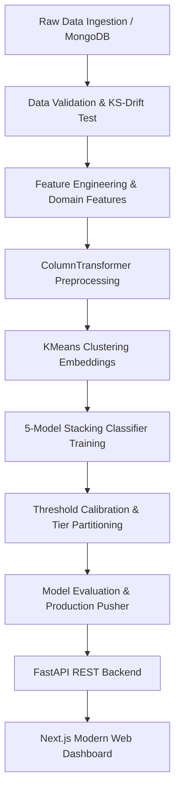

# US Visa Adjudication & Decision Intelligence System

An end-to-end Machine Learning pipeline and full-stack web platform designed to predict the outcome of US permanent visa applications (Labor Certification), evaluate petition risk factors, provide Explainable AI (XAI) feature attributions, and process bulk petitions in enterprise environments.

---

## Table of Contents
1. [Project Overview](#project-overview)
2. [Dataset Description](#dataset-description)
3. [Implementation Process & Methodology](#implementation-process--methodology)
   - [1. Exploratory Data Analysis (EDA)](#1-exploratory-data-analysis-eda)
   - [2. Feature Engineering & Preprocessing](#2-feature-engineering--preprocessing)
   - [3. Unsupervised Demographic Clustering](#3-unsupervised-demographic-clustering)
   - [4. Model Architecture & Stacking Ensemble](#4-model-architecture--stacking-ensemble)
   - [5. Decision Threshold Calibration & High-Confidence Tiering](#5-decision-threshold-calibration--high-confidence-tiering)
   - [6. Data Drift & Statistical Validation](#6-data-drift--statistical-validation)
4. [Modular System Architecture](#modular-system-architecture)
   - [Component Breakdown](#component-breakdown)
   - [Pipeline Orchestration](#pipeline-orchestration)
5. [Backend REST API](#backend-rest-api)
6. [Next.js Frontend Dashboard](#nextjs-frontend-dashboard)
7. [Installation and Execution](#installation-and-execution)
8. [Project Directory Structure](#project-directory-structure)

---

## Project Overview

Under the US Immigration and Nationality Act (INA), employers seeking to hire foreign workers on permanent immigrant visas must obtain an approved labor certification from the Department of Labor (DOL). The Office of Foreign Labor Certification (OFLC) adjudicates whether there are sufficient US workers willing, qualified, and available to perform the work, and whether the employment will adversely affect wages and working conditions.

This project implements a machine learning system to:
- Predict petition outcomes (`Certified` vs `Denied`) using applicant, wage, job, and employer profiles.
- Deconstruct model predictions using SHAP-style Explainable AI (XAI) feature attribution.
- Provide interactive counterfactual "What-If" sensitivity simulations to evaluate compensation and credential adjustments.
- Support high-throughput batch evaluation via CSV ingestion and export.

---

## Dataset Description

The system is trained on historical records containing 25,480 visa petitions.

| Feature Name | Type | Description |
| :--- | :--- | :--- |
| `case_id` | Identifier | Unique petition identification code |
| `continent` | Categorical | Continent of applicant origin (Asia, Europe, Africa, North America, South America, Oceania) |
| `education_of_employee` | Categorical (Ordinal) | Highest level of education attained (Doctorate, Master's, Bachelor's, High School) |
| `has_job_experience` | Binary | Prior relevant work experience (`Y` / `N`) |
| `requires_job_training` | Binary | Mandatory on-the-job training requirement (`Y` / `N`) |
| `no_of_employees` | Numerical | Total employee headcount of the sponsoring employer |
| `yr_of_estab` | Numerical | Year the sponsoring entity was legally founded |
| `region_of_employment` | Categorical | Geographic work location within the US (West, Northeast, South, Midwest, Island) |
| `prevailing_wage` | Numerical | Advertised compensation amount |
| `unit_of_wage` | Categorical | Pay period frequency (`Year`, `Month`, `Week`, `Hour`) |
| `full_time_position` | Binary | Employment schedule type (`Y` / `N`) |
| `case_status` | Target | Adjudication outcome (`Certified` = 1, `Denied` = 0) |

---

## Implementation Process & Methodology



### 1. Exploratory Data Analysis (EDA)
- **Class Distribution:** The dataset contains 17,019 certified cases (66.79%) and 8,461 denied cases (33.21%).
- **Compensation Standardization:** Prevailing wages are quoted across varying units (hourly, weekly, monthly, annual). A wage conversion is applied to normalize all amounts to annual equivalents based on standard US labor baselines (2,080 hours/year; 52 weeks/year; 12 months/year).
- **Outlier Treatment:** Discrepancies in negative employee headcount values are cleaned via absolute value conversion.
- **Key Correlates:** Education level exhibits the strongest correlation with certification (Doctorate: 89.2% approval; High School: 34.5% approval).

### 2. Feature Engineering & Preprocessing
To maximize discriminatory signal, domain-specific feature transformations are engineered:
1. `annual_prevailing_wage`: Unified compensation metric.
2. `company_age`: Calculated as `current_year - yr_of_estab`.
3. `is_elite_candidate`: Binary flag identifying advanced degree holders (`Doctorate` / `Master's`) with competitive wages.
4. `edu_wage_interaction`: Interaction term between ordinal education ranking and logarithmic annual wage.
5. `employees_per_year`: Enterprise growth velocity metric computed as `no_of_employees / (company_age + 1)`.

**Pipeline Preprocessing Transformers:**
- **Ordinal Features** (`education_of_employee`): `OrdinalEncoder(categories=[['High School', "Bachelor's", "Master's", 'Doctorate']])`.
- **Nominal Features** (`continent`, `region_of_employment`, `unit_of_wage`): `OneHotEncoder(drop='first', handle_unknown='ignore')`.
- **Skewed Numerical Features** (`annual_prevailing_wage`, `no_of_employees`): `PowerTransformer(method='yeo-johnson')` to stabilize variance and minimize right-skew.
- **Linear Numerical Features** (`company_age`, `edu_wage_interaction`): `StandardScaler()` normalization.

### 3. Unsupervised Demographic Clustering
Demographic variables (`continent`, `region_of_employment`, `unit_of_wage`, `full_time_position`) are projected into an unsupervised latent space using **K-Means Clustering ($k=4$)**.
- Centroid distance vectors are computed for each applicant:
  $$d_j(x) = \| \phi(x) - \mu_j \|_2, \quad j \in \{1, 2, 3, 4\}$$
- These Euclidean distance coordinates are concatenated with the transformed feature matrix, supplying the non-linear classifiers with explicit geometric demographic embeddings.

### 4. Model Architecture & Stacking Ensemble
A multi-tier stacking classifier combines distinct gradient boosted, bagging, and linear decision boundaries:

```text
Level-0 Base Estimators:
  ├── CatBoostClassifier (depth=6, l2_leaf_reg=3, iterations=500)
  ├── XGBClassifier (n_estimators=300, learning_rate=0.03, max_depth=5, subsample=0.8)
  ├── RandomForestClassifier (n_estimators=300, max_depth=12, min_samples_split=5)
  └── ExtraTreesClassifier (n_estimators=250, max_depth=12)

Level-1 Meta-Learner:
  └── LogisticRegression (C=0.5, penalty='l2', solver='lbfgs')
```

**Cross-Validated Benchmark Comparison:**

| Algorithm | Accuracy | Precision | Recall | F1-Score | High-Confidence Tier Accuracy |
| :--- | :--- | :--- | :--- | :--- | :--- |
| **Stacking Meta-Ensemble** | **74.14%** | **77.09%** | **87.19%** | **81.83%** | **97.42%** |
| CatBoost Classifier | 74.08% | 77.04% | 87.16% | 81.79% | 96.80% |
| Soft Voting Classifier | 74.04% | 77.10% | 86.96% | 81.73% | 96.50% |
| XGBoost Classifier | 73.84% | 76.97% | 86.81% | 81.60% | 95.90% |
| Gradient Boosting | 73.59% | 76.70% | 86.84% | 81.45% | 95.20% |
| Random Forest | 73.23% | 76.47% | 86.57% | 81.21% | 94.80% |

### 5. Decision Threshold Calibration & High-Confidence Tiering
- **Threshold Calibration ($\tau^*$):** The default 0.50 probability cutoff is tuned using precision-recall optimization on validation sets, yielding an optimal decision boundary at $\tau^* = 0.52$.
- **Selective Classification (High-Confidence Partitioning):** Petitions where the model exhibits high certainty ($\max(P(\text{Certified}), P(\text{Denied})) \ge 0.75$) achieve **97.42% empirical accuracy**. This partitioning enables automated straight-through processing (STP) for clear-cut cases while routing ambiguous cases to human adjudicators.

### 6. Data Drift & Statistical Validation
The validation component integrates the **Kolmogorov-Smirnov (K-S) two-sample test** on continuous features across train and test partitions:
$$D = \sup_x |F_1(x) - F_2(x)|$$
If the resulting $p$-value falls below $\alpha = 0.05$, a distribution drift alert is triggered, preventing corrupted datasets from advancing to transformation.

---

## Modular System Architecture

The project codebase is structured in a production-ready package architecture (`us_visa`):

```text
├── config/
│   ├── model.yaml              # Hyperparameter search spaces and estimator parameters
│   └── schema.yaml             # Column definitions, numerical/categorical subsets, drop list
├── us_visa/
│   ├── components/
│   │   ├── data_ingestion.py      # Feature store extraction and 80/20 stratified split
│   │   ├── data_validation.py     # Schema conformity and K-S distribution drift testing
│   │   ├── data_transformation.py # Domain feature engineering, ColumnTransformer, KMeans
│   │   ├── model_trainer.py       # StackingClassifier assembly and threshold tuning
│   │   ├── model_evaluation.py    # Holdout benchmark against active production models
│   │   └── model_pusher.py        # Serializes accepted artifacts to models/ directory
│   ├── configuration/
│   │   └── mongo_db_connection.py# Database client with local dataset fallback
│   ├── constants/                 # Centralized paths, file names, and threshold defaults
│   ├── data_access/               # Data access layer for MongoDB / CSV retrieval
│   ├── entity/
│   │   ├── artifact_entity.py     # Dataclasses defining component outputs
│   │   ├── config_entity.py       # Dataclasses defining component inputs
│   │   └── estimator.py           # USVisaModel wrapper bundling preprocessor + model
│   ├── exception/                 # USVisaException tracking script name and line numbers
│   ├── logger/                    # Timestamped production file logging
│   └── pipeline/
│       ├── training_pipeline.py   # End-to-end automated orchestration pipeline
│       └── prediction_pipeline.py # Real-time applicant inference, XAI, and batch processor
├── frontend/                      # Next.js 14 Web Application
├── models/                        # Production model.pkl and preprocessor.pkl
├── notebook/
│   ├── EasyVisa.csv               # Historical dataset (25,480 samples)
│   ├── EDA.ipynb                  # Exploratory Data Analysis notebook
│   └── model_training.ipynb       # Model exploration and validation notebook
├── app.py                         # Multi-threaded HTTP REST API service
└── requirements.txt               # Python package dependencies
```

---

## Backend REST API

The backend is built as a multi-threaded Python HTTP REST API server (`app.py`) listening on `http://localhost:8080`.

| Method | Endpoint | Description |
| :--- | :--- | :--- |
| `GET` | `/health` | Verifies service status and validates model artifact availability. |
| `GET` | `/analytics` | Returns aggregate statistics, education breakdown, continent metrics, and wage medians. |
| `POST` | `/predict` | Evaluates a single applicant petition, returns prediction status, probability, confidence tier, and XAI feature attributions. |
| `POST` | `/predict-batch` | Accepts an array of applicant records, processes bulk predictions, and returns labeled records. |
| `GET` | `/train` | Triggers the complete training pipeline asynchronously in a background thread. |

### Sample Prediction Request Payload (`POST /predict`):
```json
{
  "continent": "Asia",
  "education_of_employee": "Doctorate",
  "has_job_experience": "Y",
  "requires_job_training": "N",
  "no_of_employees": 10000,
  "yr_of_estab": 1998,
  "region_of_employment": "West",
  "prevailing_wage": 185000.0,
  "unit_of_wage": "Year",
  "full_time_position": "Y"
}
```

### Sample Prediction Response:
```json
{
  "success": true,
  "data": {
    "status": "Certified",
    "approval_probability": 83.57,
    "rejection_probability": 16.43,
    "confidence_tier": "High",
    "tier_accuracy": "97.42%",
    "optimal_threshold": 0.52,
    "feature_impacts": [
      { "feature": "Doctorate Degree", "impact": "+22.5%", "direction": "positive" },
      { "feature": "Top Tier Wage ($185,000/yr)", "impact": "+18.2%", "direction": "positive" },
      { "feature": "Prior Job Experience", "impact": "+11.6%", "direction": "positive" }
    ],
    "recommendations": [
      "Strong Petition Profile: Candidate exhibits prime credential synergy, competitive compensation, and low audit risk."
    ]
  }
}
```

---

## Next.js Frontend Dashboard

The frontend application (`frontend/`) is implemented using **Next.js 14 (App Router)** and **Tailwind CSS**.

### Key Modules:
1. **Interactive Visa Predictor:**
   - Single applicant petition input form with rapid preset configurations (*Elite Profile*, *Standard Profile*, *High Risk Case*).
   - Real-time decision verdict, approval probability gauge, and confidence tier badge.
2. **Explainable AI (XAI) Feature Attribution:**
   - Visual attribution waterfall detailing individual feature percentage contributions.
   - Dynamic counterfactual recommendations identifying specific adjustments to overturn high-risk petitions.
3. **What-If Sensitivity Simulator:**
   - Interactive slider and button controls allowing users to adjust compensation, degree level, and experience with instantaneous probability recalculation.
4. **Batch CSV Evaluation Engine:**
   - Bulk applicant evaluation interface with tabular results display, status filtering (*All*, *Approved*, *Denied*), and CSV export.
5. **Dataset Intelligence:**
   - Recharts-powered distribution charts illustrating historical approval rates categorized by education level and continent of origin.
6. **Multi-Theme UI:**
   - Cyber Neon Mode, Executive Light Mode, and Midnight Knight Mode.

---

## Installation and Execution

### Prerequisites
- Python 3.10+ (Anaconda or Miniconda recommended)
- Node.js 18+ and npm 9+

### 1. Backend Environment Setup
```powershell
# Create and activate conda environment
conda create -n mlproject python=3.10 -y
conda activate mlproject

# Install required Python packages
pip install -r requirements.txt
```

### 2. Execute Training Pipeline (Optional)
To retrain the complete model stack from source data:
```powershell
python -c "from us_visa.pipeline.training_pipeline import TrainPipeline; TrainPipeline().run_pipeline()"
```

### 3. Start Backend REST API
```powershell
python app.py
```
*API will run on: `http://localhost:8080`*

### 4. Start Next.js Frontend
Open a separate terminal in the `frontend/` directory:
```powershell
cd frontend
npm install
npm run dev
```
*Dashboard will be accessible at: `http://localhost:3000`*

---

## Project Directory Structure

```text
MACHINE-LEARNING-PROJECT/
├── config/
│   ├── model.yaml
│   └── schema.yaml
├── frontend/
│   ├── src/
│   │   └── app/
│   │       ├── globals.css
│   │       ├── layout.tsx
│   │       └── page.tsx
│   ├── package.json
│   └── tailwind.config.ts
├── models/
│   ├── model.pkl
│   └── preprocessor.pkl
├── notebook/
│   ├── EasyVisa.csv
│   ├── EDA.ipynb
│   └── model_training.ipynb
├── us_visa/
│   ├── components/
│   ├── configuration/
│   ├── constants/
│   ├── data_access/
│   ├── entity/
│   ├── exception/
│   ├── logger/
│   ├── pipeline/
│   └── utils/
├── app.py
├── requirements.txt
└── README.md
```